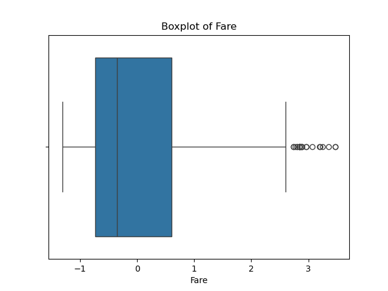

# Titanic Dataset - EDA & Preprocessing

This project performs exploratory data analysis and preprocessing on the Titanic dataset in preparation for machine learning.

## 📂 Dataset
Located at `data/Titanic-Dataset.csv`.

---

## ✅ Steps Performed

### 1. Load and Explore Data
Checked for missing values and data types.

### 2. Handle Missing Values
- Age: Filled with **median**
- Embarked: Filled with **mode**
- Dropped "Cabin" (too many nulls)
- Dropped unneccesary Features PassengerId, Ticket and Name
- No Duplicates in the DataFrame
---
### 3. Summary Stats
Used `describe`

| Statistic | Survived | Pclass   | Age       | SibSp    | Parch    | Fare     |
|-----------|----------|----------|-----------|----------|----------|----------|
| Mean      | 0.383838 | 2.308642 | 29.361582 | 0.523008 | 0.381594 | 32.204208|
| Std Dev   | 0.486592 | 0.836071 | 13.019697 | 1.102743 | 0.806057 | 49.693429|
---

### 4. Outlier Detection
- Visualized using boxplots:
  
  
- Removed Fare outliers using IQR.
---

### 5. Encode Categorical Features
- Used `pd.get_dummies` on `Sex` and `Embarked`.
---
### 6. Normalize Numerical Features
- Standardized `Age` and `Fare`.